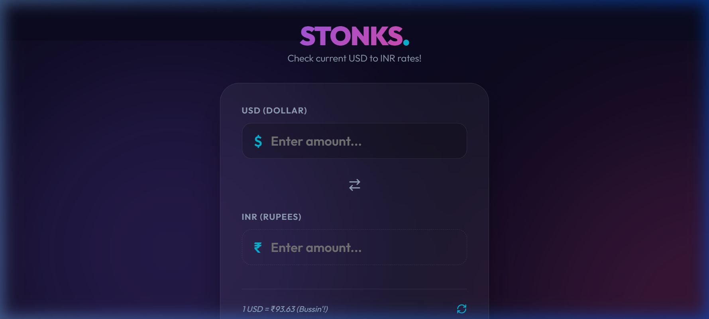

# 💸 STONKS: USD to INR Converter

The most "bussin'" way to check your exchange rates. Designed for the modern hustle, this converter is fast, sleek, and packed with Gen Z energy.

## ✨ Features
- **Modern UI**: Dark mode with futuristic glassmorphism and neon glows.
- **Micro-animations**: Smooth number counting and interactive hover effects.
- **Real-time Rates**: Live data fetching from `exchangerate-api.com`.
- **Mobile Responsive**: Looks perfect on every screen, from iPhone to Desktop.
  

## 🚀 Deployment
Check it out live!  
[Live Demo](https://avighna28.github.io/STONKS/)

## 🛠 Tech Stack
- **HTML5**: Semantic and SEO optimized.
- **CSS3**: Advanced glassmorphism, responsive @media queries, and keyframe animations.
- **JavaScript**: Async/Await fetching for real-time currency updates.
  
Made for the Gen Z hustle 💸
